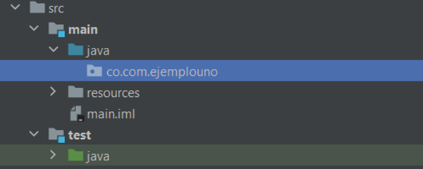

# Tutorial: Primera aplicación Spring con Intellij

## Complementos necesarios

Spring y Spring Boot (incluido).

Este tutorial describe cómo crear y ejecutar una aplicación [Spring](https://spring.io/projects/spring-boot) en [IntelliJ IDEA](https://www.jetbrains.com/es-es/idea/). Será un proyecto Spring Boot Maven generado por [Spring Initializr](https://start.spring.io). Esta es la forma más rápida de crear una aplicación Spring, e IntelliJ IDEA proporciona un asistente de proyecto dedicado para ello. Aprenderá cómo exponer un endpoint HTTP y asignarlo a un método que devuelve un saludo al usuario cuando se accede a través de un navegador web.

## Preparación

Si no ha instalado Spring y Spring Boot:

1. Recuerde tener instalado Java y en particular el JDK 8+.
2. Puedes instalar IntelliJ IDEA directamente desde la web de Jetbrains, utilizando NNF (Next, Next, Finish), para cualquier SO (Windows, Linux, macOS). Recuerde que tiene dos opciones: versión community y ultimate (esta última se puede obtener en una licencia estudiantil).
3. En Windows también lo puedes hacer a través del gestor de paquetes chocolatey. En el powershell utilizando la línea de comando: `choco install intellijidea-community`. Para Linux, por ejemplo, dependiendo la distribución utilice su gestor de paquetes `apt-get`, ``yum``, ``dnf``, … Para macOS puede utilizar el gestor de paquetes Homebrew con la línea de comando: `brew cask install intellij-idea-ce`.

### ¿Qué es Maven?

Maven es una herramienta de gestión de proyectos y comprensión que proporciona a los desarrolladores un marco completo para el ciclo de vida de la construcción. Maven, como herramienta de construcción de proyectos de código abierto desarrollada por Apache, es útil para construir, publicar y desplegar varios proyectos a la vez para una mejor gestión de proyectos. Maven se ocupa de varias áreas de interés: facilitar el proceso de construcción, proporcionar un sistema de construcción uniforme, proporcionar información de calidad sobre el proyecto y fomentar mejores prácticas de desarrollo.

#### Maven y Gradle

Tanto Maven como Gradle son herramientas de construcción de software de código abierto que se utilizan para automatizar y gestionar proyectos. Aunque ambas herramientas tienen muchas similitudes, también tienen algunas diferencias clave que pueden hacer que una sea más adecuada para un proyecto específico que la otra.

##### Maven

Maven es una herramienta de gestión de proyectos que se centra en la estandarización, es decir, en el desarrollo del software en un diseño estándar en un corto período de tiempo. Utiliza el lenguaje de marcado extensible (XML) para la estructuración de la aplicación. Algunas de las ventajas de Maven incluyen la simplificación y organización del proceso de construcción del proyecto, la ejecución automática de la tarea de descarga de archivos Jar y otras dependencias, y la fácil incorporación de nuevas dependencias formulando el código de dependencia en el archivo ``POM``. Sin embargo, Maven requiere la instalación en el sistema de trabajo y no puede implementar una dependencia si no se encuentra el código Maven para la dependencia existente.

##### Gradle

Gradle, por otro lado, es una herramienta que ayuda a crear software con mecanización. Trabaja en Java y un lenguaje específico del dominio basado en Groovy (DSL) para desarrollar la estructura del proyecto. Gradle es muy rápido y eficiente, siendo aproximadamente 2 veces más rápido que Maven. Sin embargo, se requiere un gran conocimiento técnico para construir tareas con Gradle.

##### Comparación

En resumen, la principal diferencia entre Maven y Gradle es que Maven es una herramienta de gestión de proyectos de software que gestiona las compilaciones, informes y documentos del proyecto, mientras que Gradle es una herramienta de automatización de compilaciones de código abierto centrada en la flexibilidad y el rendimiento. La simplicidad y consistencia de Maven lo convierten en una excelente opción para proyectos más pequeños o aquellos con estructuras bien definidas. Gradle, por otro lado, es más adecuado para proyectos más grandes o más complejos, ya que ofrece un mejor rendimiento, extensibilidad y flexibilidad.

#### ¿Cómo instalar Maven?

La instalación de Apache Maven es un proceso sencillo de extraer el archivo y agregar el directorio bin con el comando mvn al PATH. Aquí te dejo los pasos detallados para instalar Maven en tu sistema:

#### Prerrequisitos

1. Debes tener una instalación de JDK en tu sistema.
2. Configura la variable de entorno JAVA_HOME apuntando a tu instalación de JDK o ten el ejecutable java en tu PATH.

#### Pasos para la instalación

1. Descarga Maven desde la [página oficial de Apache Maven](https://maven.apache.org).
2. Extrae el archivo en cualquier directorio que desees.
3. Agrega el directorio bin del directorio creado (por ejemplo, apache-maven-3.9.5) a la variable de entorno PATH.
4. Confirma la instalación con `mvn -v` en una nueva terminal. El resultado debería mostrar la versión de Maven, la versión de Java y la información del sistema operativo.

##### Configuración de Maven en IntelliJ IDEA

IntelliJ IDEA proporciona una integración completa con Maven, lo que permite explorar proyectos Maven, ejecutar comandos Maven y realizar los objetivos del ciclo de vida de la construcción y los plugins.

##### Pasos para la configuración

1. Una vez cargado un proyecto Maven, la extensión se activará automáticamente y escaneará los archivos `pom.xml` en tu espacio de trabajo y mostrará todos los proyectos Maven y sus módulos en la barra lateral.
2. Puedes ejecutar los objetivos de Maven haciendo clic con el botón derecho en cada proyecto Maven en el Explorador.
3. Para depurar los objetivos de Maven, haz clic con el botón derecho en un objetivo y comienza a depurar.
4. Puedes especificar tu versión de Maven preferida en la configuración de Maven.
5. Para cambiar la versión de Java para Maven en IntelliJ, ve a Preferencias (o Configuración) en IntelliJ. Luego ve a Construir, Ejecución, Despliegue > Herramientas de construcción > Maven > Importación - selecciona el desplegable "JDK para Importador" y luego selecciona tu versión de Java preferida.

## Crear un nuevo proyecto Spring Boot

1. Ejecute IntelliJ IDEA.
2. Para este ejemplo se utiliza como build-tool Maven (es una herramienta open-source, que se creó en 2001 con el objetivo de simplificar los procesos de build: compilar y generar ejecutables a partir del código fuente; simplifica mucho el proceso de build del código, permitiéndonos compilar cualquier tipo de proyecto de la misma manera, librándonos de todas las dificultades que hay por detrás).
3. Infelizmente IntelliJ IDEA Community no brinda soporte para la creación de proyectos Spring Boot usando Spring Initializr por la propia IDE en la versión community, solamente disponible en la versión Ultimate. En este caso tenemos dos opciones:
    * Emplear Spring Initilizr Web.
    * Crear un proyecto Maven y adicionar Spring manualmente.

### Utilizando Spring Initializr Web

1. Diríjase a: <https://start.spring.io/>
2. Llene la información como lo evidencia abajo:


    Recuerde indicar Spring Web como dependencia. 

3. Genere el proyecto para bajar el comprimido. Extraiga el proyecto descargado.
4. Vaya a IntelliJ IDE y selecciones Importar Proyecto. Vaya al directorio del proyecto e impórtelo.

    

5. Note que en caso de no tener habilitado el Plugin de Maven, deberá permitir su funcionalidad. En la imagen anterior verá que el archivo pom.xml no se reconoce como Maven. Para habilitar el Plugin, siga los siguientes pasos (en caso de tener habilitado el Plugin puede saltarse este paso):

    ``File → Settings → Plugins → Maven [OK]``

    

6. Su proyecto será reconocido como Maven. Ahora lo deberá ver así:

    

7. Habilite la ventana para Maven Projects en caso de que no la tenga visible siguiendo la secuencia de pasos:

    ``View → Tool Windows → Maven Projects``

8. Si no reconoce su proyecto como Maven, de click derecho sobre el archivo pom.xml y de en la opción ``Add as Maven Project``, como se evidencia a continuación:

    

### Crear un proyecto Maven y adicionar Spring manualmente

1. Seleccione crear nuevo proyecto, en la sección de la izquierda elija Maven, del lado derecho seleccione la versión de JDK.

    

2. Al no seleccionar el arquetipo (archetype), IntelliJ IDEA entenderá que se usará el arquetipo Quickstart, lo cual está bien para nuestro ejemplo.
3. En la próxima pantalla especifique el nombre, GroupId, ArtifactId y ubicación.

    

4. Con el proyecto creado, configure el ``pom.xml`` de acuerdo con el fragmento a continuación:

```xml
<?xml version="1.0" encoding="UTF-8"?>
<project xmlns="http://maven.apache.org/POM/4.0.0"
         xmlns:xsi="http://www.w3.org/2001/XMLSchema-instance"
         xsi:schemaLocation="http://maven.apache.org/POM/4.0.0 http://maven.apache.org/xsd/maven-4.0.0.xsd">
    <modelVersion>4.0.0</modelVersion>
    <parent>
        <groupId>org.springframework.boot</groupId>
        <artifactId>spring-boot-starter-parent</artifactId>
        <version>3.1.5</version>
        <relativePath/> <!-- lookup parent from repository -->
    </parent>
    <groupId>co.com.ejemplouno</groupId>
    <artifactId>java-spring-idea-ejemplouno</artifactId>
    <version>1.0-SNAPSHOT</version>
    <name>java-spring-idea-ejemplouno</name>
    <description>Demo project for Spring Boot</description>
    <properties>
        <maven.compiler.source>11</maven.compiler.source>
        <maven.compiler.target>11</maven.compiler.target>
        <java.version>1.8</java.version>
    </properties>
    <dependencies>
        <dependency>
            <groupId>org.springframework.boot</groupId>
            <artifactId>spring-boot-starter-web</artifactId>
        </dependency>

        <dependency>
            <groupId>org.springframework.boot</groupId>
            <artifactId>spring-boot-starter-test</artifactId>
            <scope>test</scope>
        </dependency>
    </dependencies>
    <build>
        <plugins>
            <plugin>
                <groupId>org.springframework.boot</groupId>
                <artifactId>spring-boot-maven-plugin</artifactId>
            </plugin>
        </plugins>
    </build>
</project>
```

5. Después de modificar el ``pom.xml``, aparecerá una notificación para importar cambios. También puede hacerlo con la opción que genera Maven de actualización.

    

## Configuración del proyecto

En este punto, por cualquiera de los dos caminos, ya ha configurado su proyecto en IntelliJ IDEA.

Ahora procedemos a realizar algunos ajustes sobre el proyecto para ver nuestro Hola Mundo con Spring Boot.

1. Vamos a crear una clase que contendrá el Main del proyecto. Recordando que una de las buenas **prácticas java** es no crear ningún código en el paquete por defecto, por lo que diríjase al folder main/java y cree un paquete.

    

2. Escriba el nombre del paquete, en nuestro caso: ``co.com.ejemplouno``.
3. Cree una clase dentro del paquete llamada ``ExampleApplication`` y escriba el siguiente código:

```java
package co.com.ejemplouno;

import org.springframework.boot.SpringApplication;
import org.springframework.boot.autoconfigure.SpringBootApplication;

@SpringBootApplication
public class ExampleApplication {
    public static void main(String[] args) {
        SpringApplication.run(ExampleApplication.class, args);
    }
}
```

4. Para las pruebas, repita la creación del paquete y cree una clase llamada ``ExampleApplicationTests`` y escriba el siguiente código:

```java
package co.com.ejemplouno;

import org.junit.Test;
import org.junit.runner.RunWith;
import org.springframework.boot.test.context.SpringBootTest;
import org.springframework.test.context.junit4.SpringRunner;

@RunWith(SpringRunner.class)
@SpringBootTest
public class ExampleApplicationsTests {
    @Test
    public void contextLoads() {
    }
}
```

En este punto tenemos esencialmente el mismo proyecto generado por Spring Initializr.

## Completando el proyecto

1. Con el esqueleto básico del proyecto montado, basta con crear un paquete para nuestro endpoint de ``Hola Mundo!``. Haga click derecho sobre el paquete raíz y cree un paquete para ``Controllers``.
2. Dentro del paquete ``Controllers``, cree la clase ``ExampleController``. Escriba el siguiente código:

```java
package co.com.ejemplouno.controllers;

import org.springframework.http.ResponseEntity;
import org.springframework.web.bind.annotation.GetMapping;
import org.springframework.web.bind.annotation.RequestMapping;
import org.springframework.web.bind.annotation.RestController;

/**
 * ExampleController
 *
 * @author norbeydanilo
 *
 */
@RestController
@RequestMapping("/api/example")
public class ExampleController {
    @GetMapping("/hello-world")
    public ResponseEntity<String> get() {
        return ResponseEntity.ok("Hello World!");
    }
}
```

### Ejecución del proyecto

Para la ejecución haga click sobre la clase principal y seleccione en la opción ``Run '...'``:


Verá la salida y ejecución en la ventana inferior de IntelliJ IDEA.


### Prueba del servicio

Para probar el servicio REST creado, se puede usar la herramienta Postman o cualquier otra similar. Se debe ingresar la URL del endpoint `http://localhost:8080/api/example/hello-world` y seleccionar el método GET. Al enviar la solicitud, se debe obtener una respuesta con el texto ``Hello World!`` y el código de estado ``200 OK``.


### Detener la ejecución del proyecto

Para detener la ejecución del proyecto, se puede hacer click en el botón rojo de stop en la ventana inferior de IntelliJ IDEA.

### Modificar el puerto por defecto de la aplicación

Para modificar el puerto por defecto de la aplicación, se puede crear o editar el archivo `application.properties` dentro de la carpeta `src/main/resources` y agregar la siguiente línea:

```properties
server.port=8081
```

Esto hará que la aplicación se ejecute en el puerto 8081 en lugar del 8080. Se debe reiniciar la aplicación para que el cambio tenga efecto.

### Importante

¡Tenga en cuenta las versiones con las cuales trabaja! En ``Spring Initializr`` debe seleccionar la versión adecuada de ``Spring Boot`` que trabaje con su versión de ``Java``. Debe revisar cual es la versión de java y el JDK (Java Development Kit) en su equipo.

Con ``java --version``

Conocerá la versión de java en su equipo, SE Runtime Environment y Server VM. Esa misma versión debe considerarla para crear su proyecto Maven para Spring Boot y revisar la compatibilidad. En el [enlace](https://endoflife.date/spring-boot) puede validar la compatibilidad de Java con cada Release de Spring Boot


Nótese que la definimos es 3.1.5 en este ejemplo, por lo tanto debe trabajar con java 17+.

Adicionalmente, en IntelliJ IDEA debe configurar la versión de SDK para el proyecto y los módulos. Tenga en cuenta que si no tiene un SDK compatible, lo puede descargar desde el mismo IntelliJ:


## Información adicional

Si tiene IntelliJ Ultimate podrá crear un proyecto directamente desde el IDE sin necesidad de ir a Spring Initializr. Puede guiarse del siguiente tutorial: [enlace](https://www.jetbrains.com/help/idea/your-first-spring-application.html#create-new-spring-boot-project).

> Created with <3 by norbeydanilo
