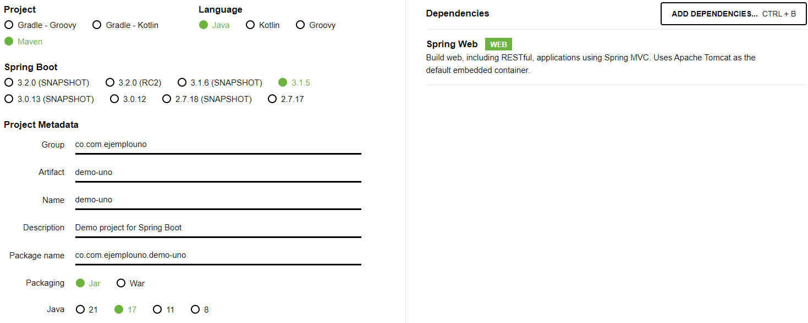

# Creación de un Proyecto Spring Boot con Visual Studio Code

Este documento proporciona una guía paso a paso para crear un proyecto Spring Boot utilizando Visual Studio Code (VSCode).

## Pre-requisitos

Antes de comenzar, asegúrese de tener instaladas las siguientes extensiones en VSCode:

1. Java Extension Pack
2. Spring Boot Extension Pack

Estas extensiones proporcionan un conjunto de herramientas útiles para desarrollar aplicaciones Java y Spring Boot.

## Pasos para la Creación del Proyecto

1. Genere su proyecto base en [Spring Initializr](https://start.spring.io).



2. Abra el proyecto con VSCode una vez descargado y descomprimido.
3. Ejecute el proyecto. Esto se puede hacer con las extensiones de VSCode para Java o a través de la terminal de su sistema operativo. En el caso de Windows, el comando sería: `.\mvnw.cmd spring-boot:run`.

## Creación del "Hola Mundo"

1. Cree la carpeta `Controller` dentro del paquete donde se encuentra su clase principal.
2. Dentro de esta carpeta, cree la clase `DemoApplicationController` e incluya el siguiente código:

```java
import org.springframework.web.bind.annotation.RequestMapping;
import org.springframework.web.bind.annotation.RestController;

@RestController
public class DemoApplicationController {
    
    @RequestMapping("/")
    public String hola(){
        return "Hola Mundo!";
    }
}
```

`@RestController` es una anotación en Spring que se utiliza para crear servicios web RESTful. Es una anotación conveniente que combina ``@Controller`` y ``@ResponseBody``, lo que elimina la necesidad de anotar cada método de manejo de solicitudes de la clase del controlador con la anotación ``@ResponseBody``. Esto significa que los métodos en una clase con la anotación ``@RestController`` están listos para usar tal como están para manejar las solicitudes de la API REST.

Por otro lado, ``@RequestMapping`` es una anotación utilizada para mapear las solicitudes HTTP a los métodos del controlador en Spring. En el ejemplo, se utiliza para mapear la ruta de acceso ``/`` a un método específico en el controlador. Cuando se realiza una solicitud HTTP a esta ruta, Spring invocará el método anotado con ``@RequestMapping``.


## Uso de Spring Initializr en Visual Studio Code

Spring Initializr es una extensión de Visual Studio Code que permite generar proyectos Spring Boot de manera rápida y sencilla. Aquí te dejo un paso a paso de cómo usarlo:

1. **Lanza Visual Studio Code**: Abre tu editor Visual Studio Code.

2. **Abre la paleta de comandos**: Presiona `Ctrl + Shift + P` para abrir la paleta de comandos.

3. **Inicia Spring Initializr**: Escribe "Spring Initializr" en la paleta de comandos para comenzar a generar un proyecto Maven o Gradle.

4. **Sigue el asistente**: Aparecerá un asistente que te guiará a través del proceso de creación del proyecto. Deberás seleccionar las opciones que se ajusten a tus necesidades, como el lenguaje de programación, la versión de Spring Boot, el tipo de proyecto (Maven o Gradle), y las dependencias que necesites.

5. **Edita las dependencias del proyecto**: Una vez generado el proyecto, puedes agregar o eliminar dependencias navegando a tu archivo `pom.xml`, haciendo clic derecho y seleccionando "Add starters". Aparecerá un menú desplegable que muestra las dependencias que ya tienes (comenzando con un √). Puedes buscar otras dependencias que quieras agregar a tu proyecto, o puedes hacer clic en las dependencias existentes para eliminarlas.

¡Y eso es todo! Ahora deberías tener un nuevo proyecto Spring Boot listo para ser desarrollado en Visual Studio Code.

## ¿Qué es Maven?

Maven es una herramienta de software para la gestión y construcción de proyectos Java. Se utiliza para definir cómo se construye un proyecto, declarar sus dependencias y controlar las versiones de las mismas.

## Configuración de Maven en Visual Studio Code

Para configurar Maven en VSCode, necesitará la extensión "Maven for Java". Una vez instalada, Maven se integrará automáticamente con VSCode y podrá gestionar sus proyectos Maven directamente desde el editor.

## Estructura de Archivos del Proyecto

Los proyectos siguen una estructura de archivos estándar para aplicaciones Spring Boot. Aquí te dejo una descripción de cada uno de los componentes:

### /Controllers

Ej. `UserController.java`. Este controlador se encarga de recibir las peticiones y ejecutar la lógica principal, que la mayoría de las veces implica llamar a un servicio.

### /Services

Ej. `UserService.java`. Este servicio define las acciones permitidas en el sistema. Todo lo que se permite a quien lo solicita, por ejemplo: actualizar, buscar, operaciones de lógica, etc.

## /Repositories

Ej. `UserRepository.java`. Este repositorio incluye los métodos que llama el servicio. Tiene la lógica de conexión de persistencia, acciones de mapeo de objetos, métodos de operaciones de base de datos (consultas, etc.).

## /Models

Ej. `UserModel.java`. Este modelo representa una tabla/entidad/tipo/colección en una clase Java.

> Created with <3 by norbeydanilo